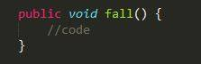
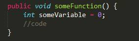
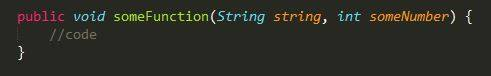

# DesignReport

##1.  Inngangur##
Tilgangur skýrslunnar er að gera grein fyrir þeim hönnunarákvörðunum sem áttu sér stað við þróun verkefnisins TicTacToe. 

Markmið verkefisins var að hanna TicTacToe leik, fyrst keyrandi í console glugga og svo yfirfæra yfir á vafraform. 

##2.  Þróunarumhverfi og vinnuflæði##
Við smíð verkefnisins var notast við Git samstæðustjórnun til að hýsa kóðann og deila kóða á milli einstaklinga. 

Verkefnið var unnið í “Test Driven Development” þar sem próf voru skrifuð fyrir hvert fall og engum kóða var pushað nema hann hafi staðist einingaprófun. Unnið var útfrá “Gitflow Workflow” við þróun leiksins.

##3.	 Forritunarreglur##
Verkefnið verður skrifað í Java forritunarmálinu og fylgja skal eftirfarandi forritunarreglum:

a)	Slaufusvigar falla skulu alltaf opnast í sömu línu og yfirlýsing falla, klasa og lykkja

b)	Undanþága er gerð á slaufusvigum við upphafsstillingu breyta

c)	Klasar eru skýrðir í PascalCasing

d)	Breytur og föll eru skýrð í camelCasing

e)	 Þegar breytur eru sendar inn í föll skal ekki fylgja bil eftir að svigi opnast

 

##3.	Hönnun##

Til að byrja með fórum við yfir það helsta sem þyrfti til að útfæra tic-tac-toe:

* **Leikborð**
    | 1 | 2 | 3 |
    |---|---|---|
    | 4 | 5 | 6 |
    | 7 | 8 | 9 |
    * Geymt í einföldum Array

* **Leikmenn**
	* Tveir geta spilað leikinn
	* Einn leikmaður fær merkið X og hinn O, fyrri leikmaður er alltaf X
	* Athuga verður hvor leikmaðurinn á leik
	* Leikmenn verða að geta merkt hvar þeir vilja setja merkið sitt
	* Ekki er hægt að setja merki tvisvar á sama stað
	* Notaður er tvöfaldur Array til að halda utan um stöður sem merkja sigur
	* Leikborðið er borið saman við sigur stöður til að athuga hvort leik sé lokið
	* Ef borðið er fullt og enginn er búinn að vinna þá er jafntefli
	* Halda utan um fjölda sigra leikmanns
	
* **Notendaviðmót**
    * Leikmenn eru beðnir um nafn
	* Sýna verður Leikborðið
	* Sýna verður hvor leikmaðurinn á að gera
	* Í Console útgáfunni skrifar leikmaðurinn tölu til að segja um hvar hann vill setja merkið sitt
	* Í vefútgáfunni smellir leikmaðurinn á leikborðið til að segja til um hvar hann vill setja merkið sitt

##4.   Útfærsla og prófanir##

Við bjuggum til fjóra klasa TicTacToeApp, TicTacToePlayer, TicTacToeConsoleUI (skipt út síðar fyrir WebUI), TicTacToeLogic og tvo klasa fyrir prófanir TicTacToeLogicTest og TicTacToePlayerTest.
Gradle var notað til að builda og keyra prófanirnar, Travis var notað fyrir stöðuga samþættingu þar sem hann buildar og keyrir prófin við hverja breytingu sem verður á verkefninu. Engum kóða var pushað nema eftir að hafa staðist prófanir. Þegar við breyttum leiknum úr console útgáfu í vefútgáfu byrjuðum við að nýta okkur Heroku til að koma leiknum í notkun.
 

##4.	Klasarit##

