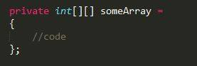
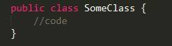

# DesignReport

##1.  Inngangur##
Tilgangur skýrslunnar er að gera grein fyrir þeim hönnunarákvörðunum sem áttu sér stað við þróun verkefnisins TicTacToe. Markmið verkefisins er að hanna TicTacToe leik, fyrst keyrandi í console glugga og svo yfirfæra yfir á vafraform. 

##2.  Þróunarumhverfi og vinnuflæði##
Við smíð verkefnisins verður notast við Git samstæðustjórnun til að hýsa kóðann og deila kóða á milli einstaklinga. 

Próf verða skrifuð fyrir hvert fall og verkefnið þannig unnið í “test driven development”. Engum kóða verður pushað fyrr en hann hefur staðist einingaprófun.
Unnið verður útfrá “Gitflow Workflow” þar sem notast er við tvö branch til að skrá sögu verkefnisins. Master branch sem heldur utan um sögu tilbúinna útgáfa og develop sem þjónar þeim tilgangi að samþátta fídusa(features), en nýtt branch er
búið til útfrá develop fyrir hvern fídus. 

Þegar allir fídusar eru tilbúnir fyrir næstu útgáfu er búið til branch útfrá develop til að fínpússa verkefnið og að lokum er þetta branch samþáttað við master og gefið útgáfu númer.
Búa verður til pull-request áður en branch er samþáttað.

##3	 Forritunarreglur##
Verkefnið verður skrifað í Java forritunarmálinu og fylgja skal eftirfarandi forritunarreglum:

a)	Slaufusvigar falla skulu alltaf opnast í sömu línu og yfirlýsing falla, klasa og lykkja

b)	Undanþága er gerð á slaufusvigum við upphafsstillingu breyta

c)	Klasar eru skýrðir í PascalCasing

d)	Breytur og föll eru skýrð í camelCasing

e)	 Þegar breytur eru sendar inn í föll skal ekki fylgja bil eftir að svigi opnast

##4.	Klasarit##

